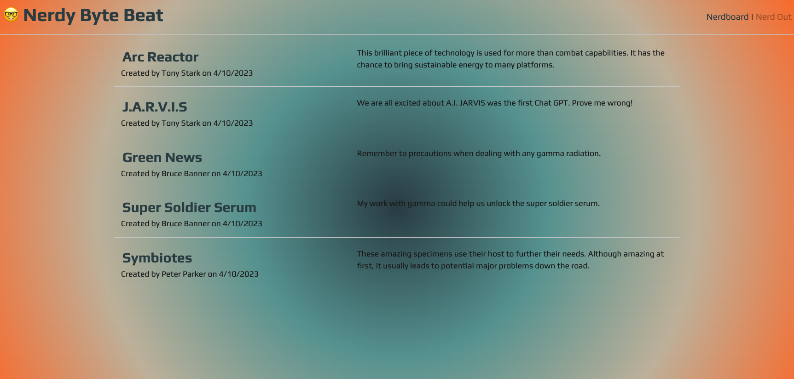

# Nerdy Byte Beat

---

## Table of Contents

* [Deployed](#deployed)
* [Description](#description)
* [Technologies](#technologies)
* [Usage](#usage)
* [Screenshot](#screenshot)
* [Questions](#questions)
* [Credits](#credits)
* [Licenses](#licenses)

## Deployed

---
Visit the Nerdy Byte Beat at TODO: heroku path

## Description

---
As a  developer who writes about tech I want a CMS-style blog site so that I can publish articles, blog posts, and my thoughts and opinions. Look no further than the Nerdy Byte Beat.

This is a full stack application which displays the Model-View-Controller (MVC) paradigm. With a combination of Front-End and Backend technologies, Nerdy Byte Beat delievers a functional and clear user experience.

## Technologies

---

* Handlebars.js
* CSS
* JavaScript
* MySQL
* Sequelize
* Express.js
* Node.js
* Bcrypt
* Dotenv

## Usage

---

As you visit this site, you will be met with the homepage.  Here you will be given the option to signup or if you have already done so, use your credentials to login.  You may also click the NerdIn tab in the upper right corner to login in as well.  If there are exisiting posts, they will also show on the homepage.

Clicking the title of an existing blog post will take you to the full news story shared by the creator.

Within a post, you can click on the post to view comments created by other users. If you are logged in, you have the option to leave a comment on the post.

Logged in users will see a link in the navigation called "Nerdboard" which will bring you to a page where you can create, view, edit, or delete your posts.

Clicking the "Nerd Out" link in the navigation will sign you out of the site and take you back into view-only mode.

At any time, select the "Nerdy Byte Beat" title in the navigation bar to return to the home page.

## Screenshot

---

## Questions

---
Do you have any questions, comments, or ways to improve this project? 

GitHub: https://github.com/TyGosley

Email: tygosley@gmail.com

## Credits

---

[Handlebars](https://handlebarsjs.com/guide/#what-is-handlebars)

[NPM](https://docs.npmjs.com/)

[Dotenv](https://www.npmjs.com/package/dotenv)

[MySQL Tutorial](https://www.mysqltutorial.org/mysql-foreign-key/)

[MySQL Docs](https://dev.mysql.com/doc/c-api/8.0/en/c-api-introduction.html)

[Codecademy](https://www.codecademy.com/learn)

[Khan Academy](https://www.khanacademy.org/)

[MDN Docs](https://developer.mozilla.org/en-US/)

[W3Schools](https://www.w3schools.com/js/default.asp)

[JavaScript.info](https://javascript.info/)

[CodeHS](https://codehs.com/)

## Licenses

---
